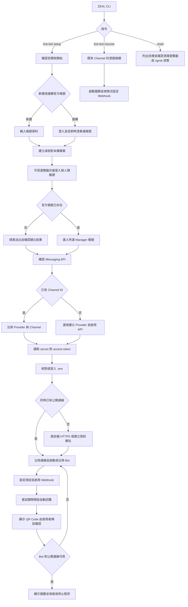
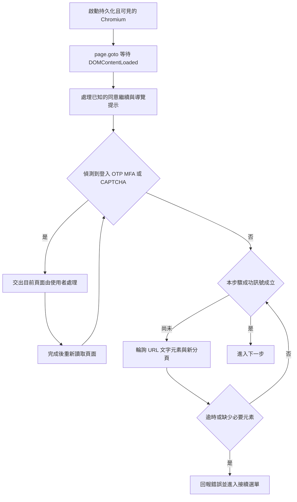
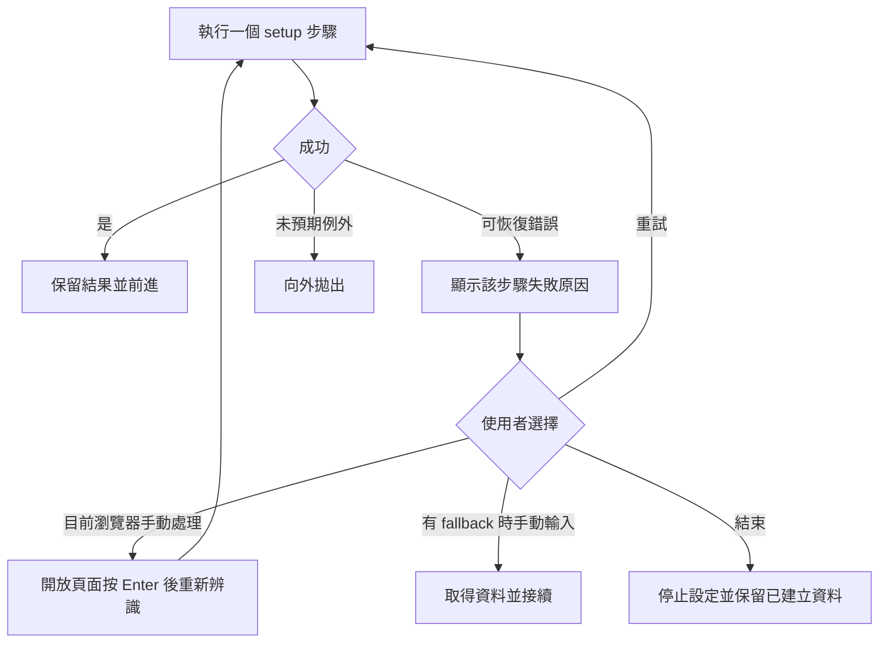
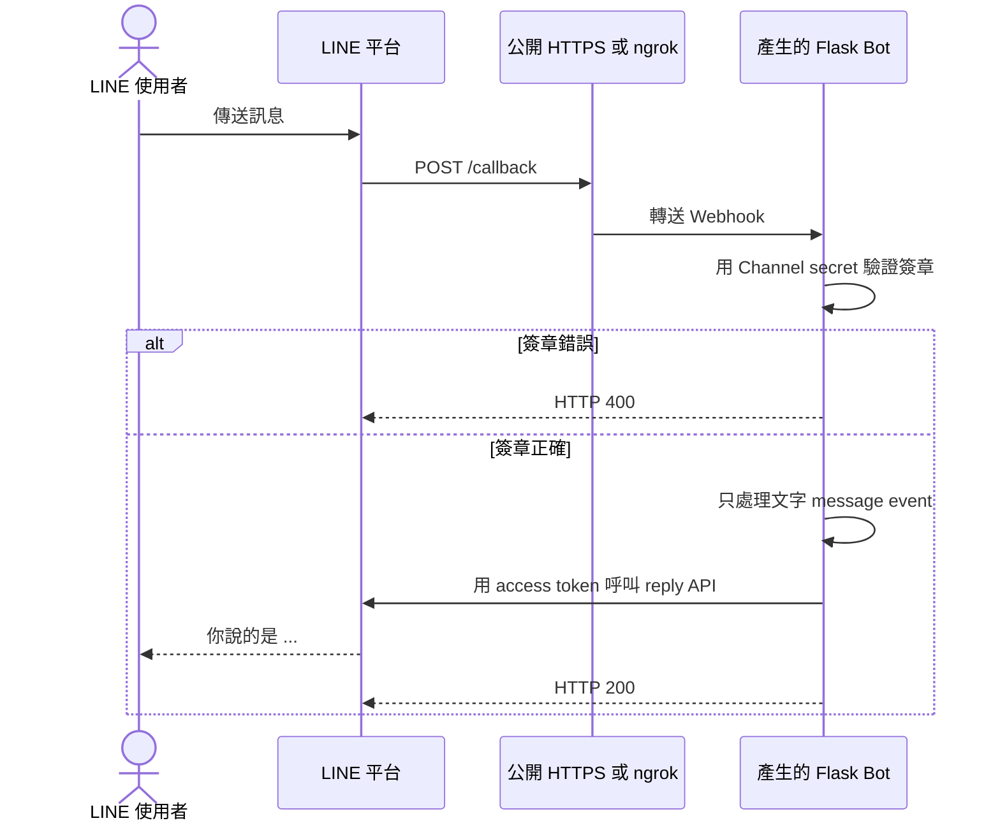

# ZEAL 處理流程

本文件記錄目前工作目錄中的 CLI、LINE Bot 設定、瀏覽器操作、失敗接續，以及產生的 Bot 如何收訊。主要實作在 [cli.py](../src/zeal/cli.py)、[line_bot.py](../src/zeal/line_bot.py)、[browser_gate.py](../src/zeal/browser_gate.py) 與 [reset.py](../src/zeal/reset.py)。流程圖使用 Mermaid。

## 整體流程

`setup` 的八個終端機步驟以手機收到 Bot 回覆為完成標準。先選新建或接續官方帳號；Channel 憑證就緒後，才檢查同埠既有公開連線，必要時詢問自備 HTTPS 或測試用網址。`resume` 讓已持有 Channel 憑證的使用者手動接續；沒有 Channel ID 或指定 `--no-browser` 時提供手動 Webhook 網址。`reset` 獨立執行，保留產生的 Bot 專案與 `.env`。

## 網頁載入與元素辨識

`DOMContentLoaded` 只表示初始 HTML 已解析。LINE 的動態內容還須以該步驟的 URL、可見文字、具名控制項、表單選項或 LINE API 狀態確認；單一載入事件不代表設定完成。

| 階段 | 如何比對 | 完成條件與等待 |
| --- | --- | --- |
| 既有帳號 | 在 `manager.line.biz` 讀可見的 `a[href*='/account/']`，核對 `/account/<id>` 路徑，取文字作名稱並去重。 | 找到帳號才回傳；登入頁交使用者操作，其餘最多約 8 秒、每 100 ms 重看。讀不到清單可重試或手動開啟帳號首頁。 |
| 新帳號表單 | 確認 `entry.line.biz/form/entry/unverified` 與至少 3 個 `select`；文字欄位用精確名稱的 `get_by_role('textbox', ...)`；業種讀當前 `option`。 | 每輪最多等 10 秒找表單；登入或驗證期間繼續等待。選大分類後等小分類第一個非占位選項附加，最多 10 秒。 |
| 已知按鈕 | `_click_first` 依中英日文候選文字做 `get_by_text(..., exact=True)`；已知同意／繼續頁優先用具名 button。 | 必要按鈕最多搜尋 8 秒，非必要 3 秒，每 100 ms 重看；必要操作找不到就報錯。 |
| 帳號建立 | 看 Manager／Developers Console 網址或明確的建立成功文字；另看驗證文字與 CAPTCHA frame。 | 每輪最多等 15 秒；已按「完成」卻無成功訊號時停止，避免盲目重送。 |
| Messaging API | Manager 頁中有標籤的 Channel ID，或 Console `/channel/<id>/messaging-api` URL；Provider 清單讀 radio 對應標籤。 | 有至少 6 位數 Channel ID 就沿用；否則分階段等 Provider 清單和新 ID，各約 8 秒。 |
| 憑證 | 從 Messaging API 頁面可見文字辨識長期 token 與 32 位十六進位 Channel secret。 | token 先等 8 秒；只有唯一的 `Issue` 按鈕才發行第一個 token，再等最多 12 秒；不點 `Reissue`。secret 最多等 8 秒。 |
| Webhook 開關 | Console 先找具 `webhook` 名稱的 checkbox，或唯一的 `input[name='active']`；Manager 使用指定 webhook switch。 | 控制項最多等 10 秒；最後以 LINE API 回傳 `endpoint == 本次網址` 且 `active is True` 為準，最多輪詢 65 秒。 |

`BrowserGate` 以 Chromium CDP 的 `Input.setIgnoreInputEvents` 控制實體輸入。灰色遮罩代表 ZEAL 操作；`_act` 只在單次 Playwright 點擊、填寫或選擇時暫時開放輸入。綠色提示代表使用者可在目前頁面完成登入、OTP/MFA、CAPTCHA 或故障排除。新分頁也會套用交接規則。遮罩只顯示狀態，不攔截 Playwright 點擊。

## 失敗與接續

`retry_setup_step` 處理 `SetupError`、`OSError`、`TimeoutError` 和 Playwright 例外；其他例外向外傳遞。重試由使用者選擇，沒有固定的自動次數，也不從第一步重來。只有仍有瀏覽器頁面時提供頁面手動處理；只有該步驟傳入 fallback 時才提供終端機手動輸入。

- 公開連線／Bot 啟動失敗時，`start_setup_runtime` 先停止本次啟動的程序，再提供重試、換埠、重輸 Authtoken、改用自備 HTTPS 或結束。換埠前核對 `.env`，再原子更新。
- ngrok 啟動後最多等 30 秒，從本機 inspector 取得 HTTPS 網址；只沿用指向同一 Bot 埠的既有通道。自備網址或已被占用的本機埠須通過 LINE Webhook test 才沿用。
- `set_and_test_webhook` 以 LINE 公開 API 設定 URL 並測試。只有測試回傳 `502`、`503`、`504` 時自動重試，最多 5 次，重試前依序等 1、2、3、4 秒；其他失敗立即交由步驟錯誤處理。
- Use webhook 開關在 Console 與 Manager 各最多嘗試兩輪；每輪後查 LINE API 的 `active`，避免點擊其實成功卻再切回關閉。仍未啟用就交使用者手動操作，最後再以 API 的 URL 與 active 狀態確認。
- 關閉 LINE 預設自動回覆失敗只顯示人工操作提示。專案的產生檔案須完全相符才能沿用；既有 `.env` 也須與本次 Channel 憑證和埠完全相符。衝突時由使用者選備份後覆寫或另建專案。
- 使用者手機測試後按 Enter，ZEAL 再查 Bot 程序、埠與公開連線。若服務已停止，當場重啟並重驗 Webhook；此檢查不能取代使用者確認手機實際收到回覆。
- `setup` 預設保留已驗證的背景服務；驗證後中途結束時也會保留。指定 `--stop-after-setup` 則在結束時停止本次程序；未達已驗證狀態而失敗時也會停止本次程序。

## 產生的 Bot 收訊

`line_bot.py` 的 `generated_app()` 產生專案中的 `app.py`。Bot 從 `.env` 載入憑證，先以 HMAC-SHA256 驗證 `X-Line-Signature`，再略過非訊息與非文字事件。沒有事件的 Webhook 驗證請求會記錄後回傳 200；回覆 API 失敗會記錄並拋出錯誤。

`zeal reset` 先列出將處理的本機瀏覽器 profile、Playwright Chromium 元件或 ZEAL 管理的 ngrok 資料，預設要求輸入 `RESET`。它保留 Bot 專案、`.env` 與日誌，不會變更 LINE 帳號或 Channel。
